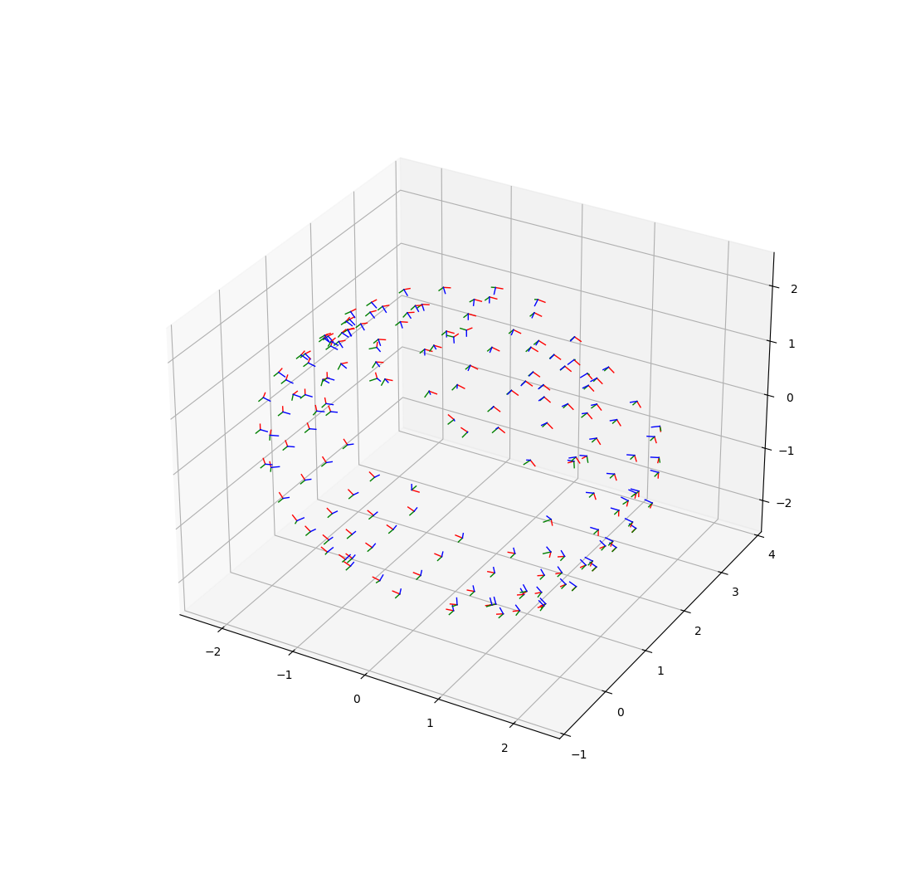
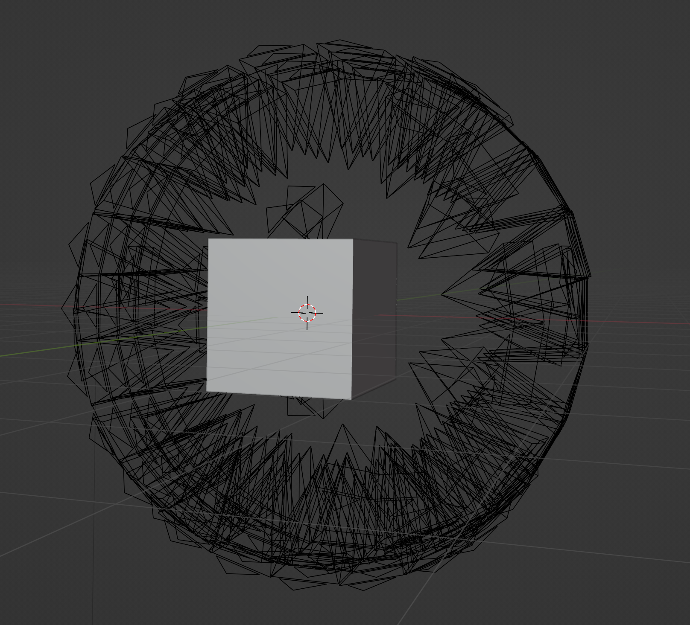

# visualize-camera

visualize dataset camera through blender and matplotlib

If you want to visualize through matplotlib, run:

```shell
python main.py --vis_type matplotlib
```



If you want to visualize through blender, run:

```shell
python main.py --vis_type blender
```

then paste the generated code to blender script.


